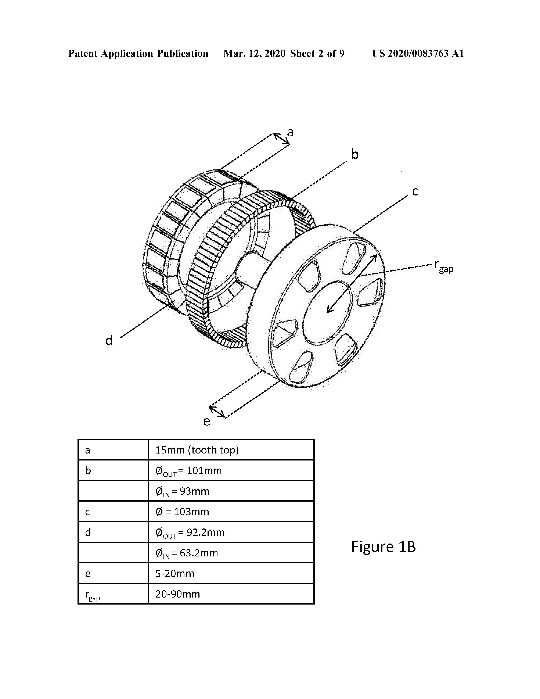

@1x_tech
' US20200083763A1 patent introduces an innovative motor and actuation system design for enabling direct drive control of human-like robots.

This patent provides hints at the operating principles of the robots they are developing. 🧵

[FIG. 3: A schematic diagram of a robot limb, in this case a robot arm]
[FIG. 6: A schematic of a human-like robot]

1. Core Innovation:
✅ Compact, lightweight, high-torque motor design using a Halbach array magnet structure
✅ Direct drive control with low gear ratios (ideally 1:1 to 1:5) for improved backdriveability and safety
✅ Cable-driven joint actuation for reduced backlash and improved control

2. Key Components:
1️⃣ Rotor with Halbach array magnet structure
2️⃣ Stator with optimized pole design 
3️⃣ Synthetic fiber cable drive system
4️⃣ Differentials for multi-axis joint control
5️⃣ Optimized motor placement in robot structure

3. Key Technical Features:
1️⃣ Magnet thickness optimized to prevent demagnetization at peak torque/temperature
2️⃣ Prime number of rotor pole pairs to reduce cogging torque
3️⃣ Stator design balancing magnetic field strength and weight
4️⃣ Cable routing system allowing joint rotation without affecting cable tension
5️⃣ Novel cable termination method using ball bearings in synthetic sleeves

[FIG. 1A: An expanded view of a compact high torque motor]
[FIG. 1B: The motor according to FIG. 1A showing a series of possible sizes for many of the elements]

FIG. 1A and 1B show the detailed design of the compact, high-torque motor at the heart of this system and possible size variations.

[FIG. 2A: Cross-section of a tooth in the stator]
[FIG. 2B: The diagram of FIG. 2A showing a possible range of dimensions]

FIG. 2A and 2B illustrate the cross-section of a stator tooth and its possible range of dimensions, crucial for optimal balance between magnetic field strength and weight.

4. Operational Mechanism:
1️⃣ High-torque motors drive joints via cable systems
2️⃣ Direct connection between motors and joints (no intermediate shafts)
3️⃣ Differentials enable multi-axis joint control (e.g. elbow bend and twist)
4️⃣ Motors placed closer to robot torso to reduce moving mass
5️⃣ Symmetric motor placement to counteract gravity effects

[FIG. 4: A diagram showing torque transfer from the motor to a differential in a robot arm]

FIG. 4 shows the innovative cable routing system that maintains tension during joint rotations.

[FIG. 5: Examples of a termination housing for the cables in the drive system]

FIG. 5 illustrates examples of termination housing for the cables in the drive system, crucial for maintaining cable tension.

5. Key Advantages:
✅ Improved backdriveability for safer human-robot interaction
✅ Reduced need for complex sensor systems
✅ More accurate position/force control due to reduced backlash and friction
✅ Lighter, more compact joint designs allowing human-like range of motion
✅ Potential for all motors to be mounted near the robot's torso

This technology represents a significant advancement in creating robots that can safely and naturally interact with humans by addressing fundamental limitations of traditional high gear ratio designs.

Bibliography

#️⃣ Patent No.: US20200083763A1
📋 Title: Human-like direct drive robot
🏢 Applicant: Halodi Robotics AS
👥 Inventors: Nguyen; Phuong; BØRNICH; Bernt Øivind
📅 Filing Date: 2019-08-13
📤 Publication Date: 2020-03-12
🔗 Link: https://patents.google.com/patent/US20200083763A1

