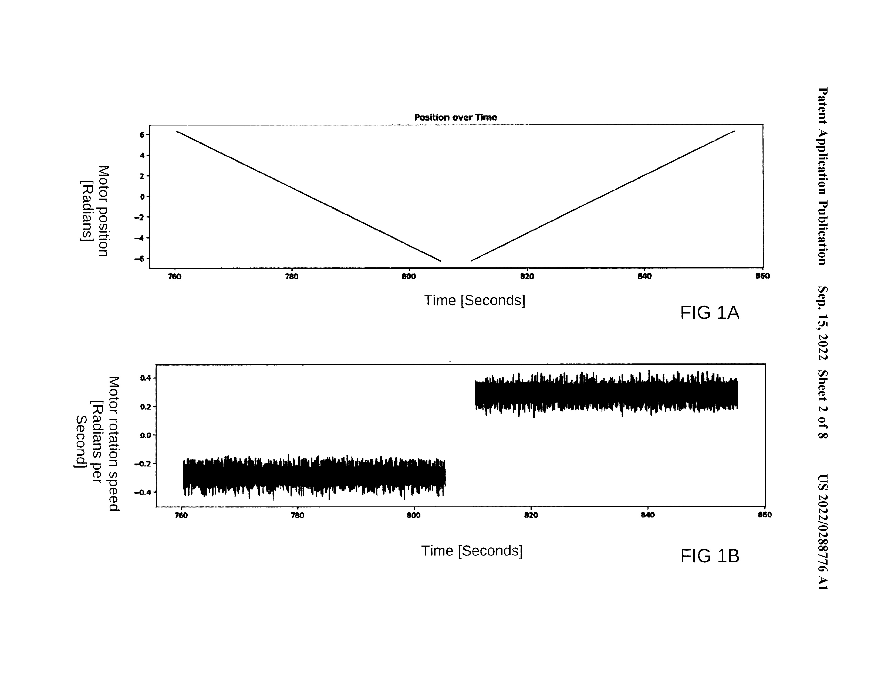
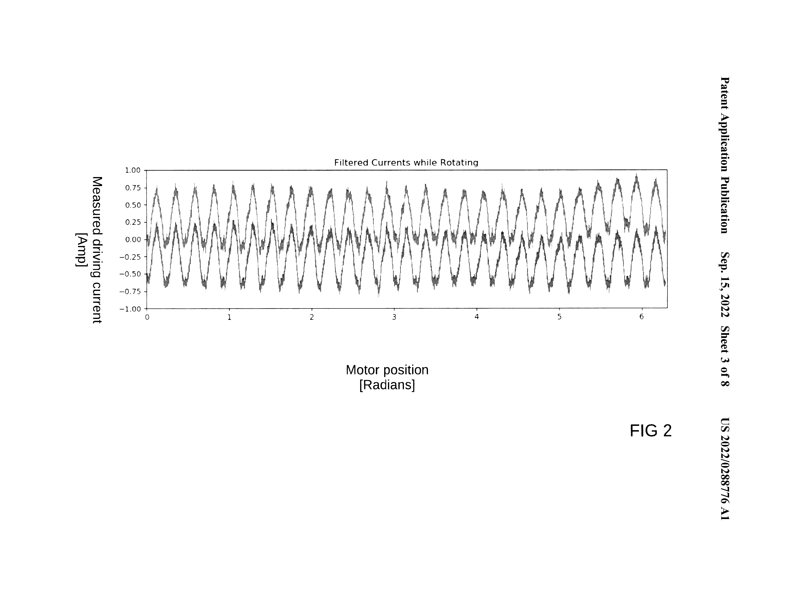
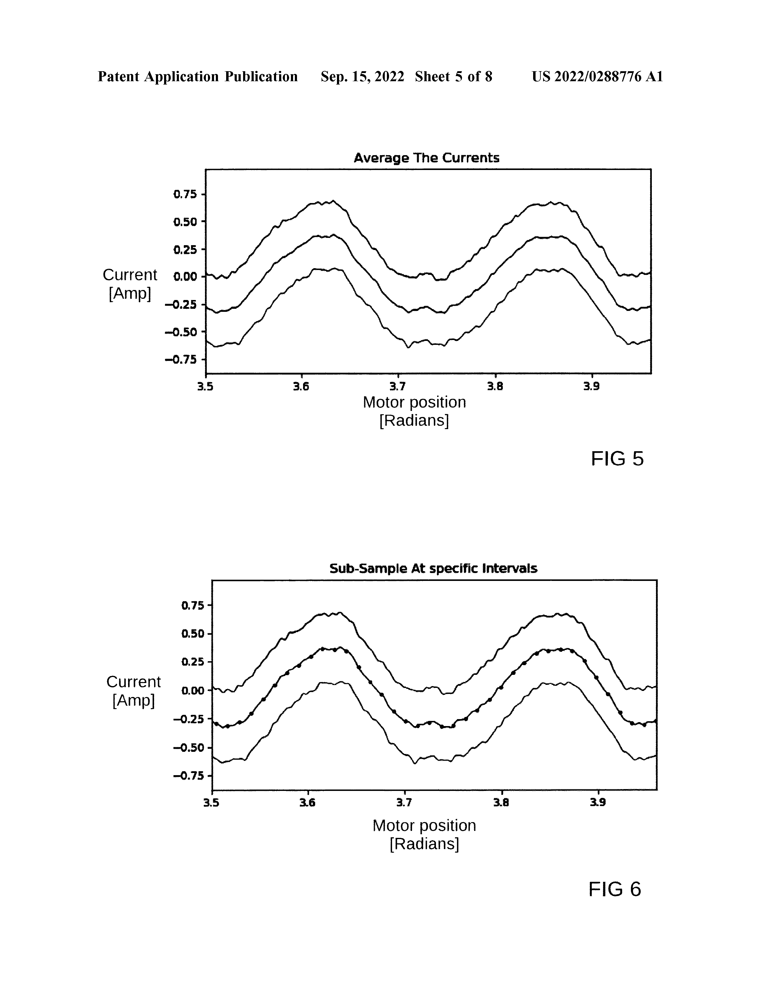
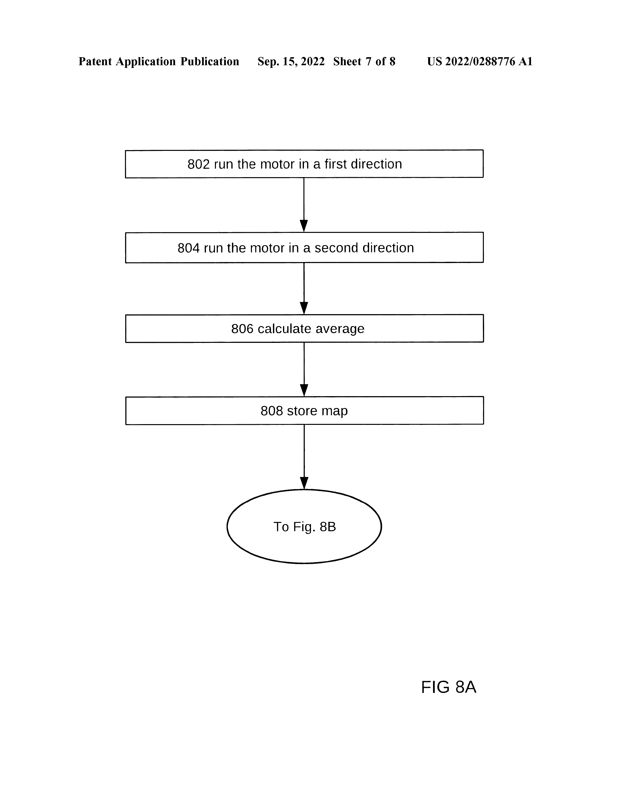
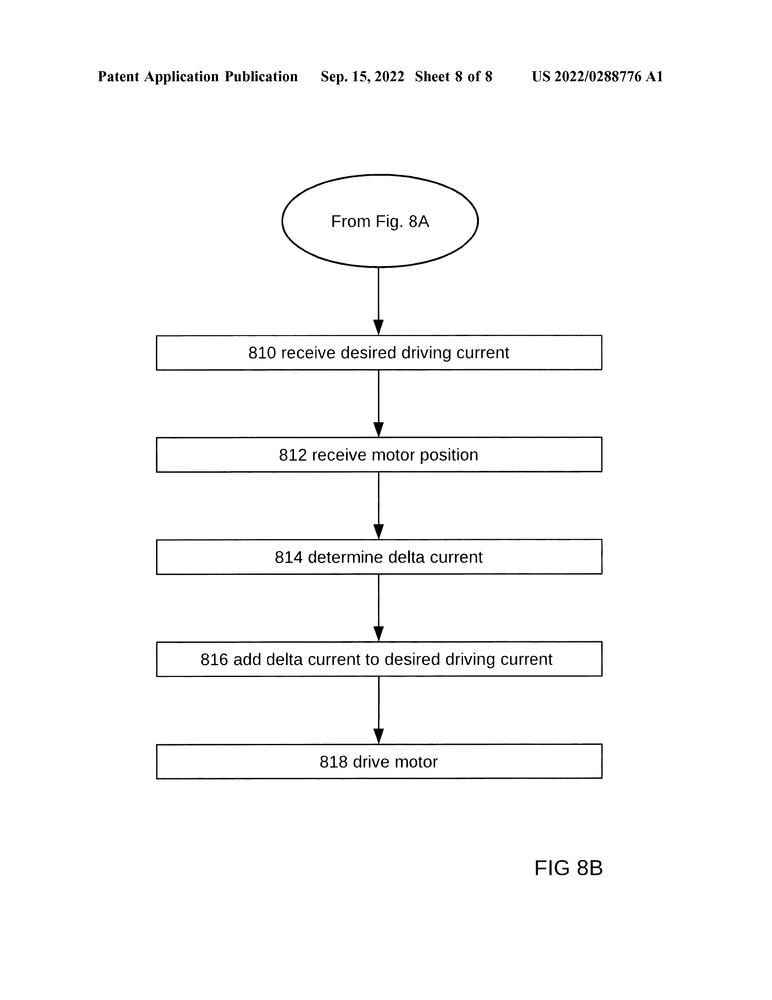
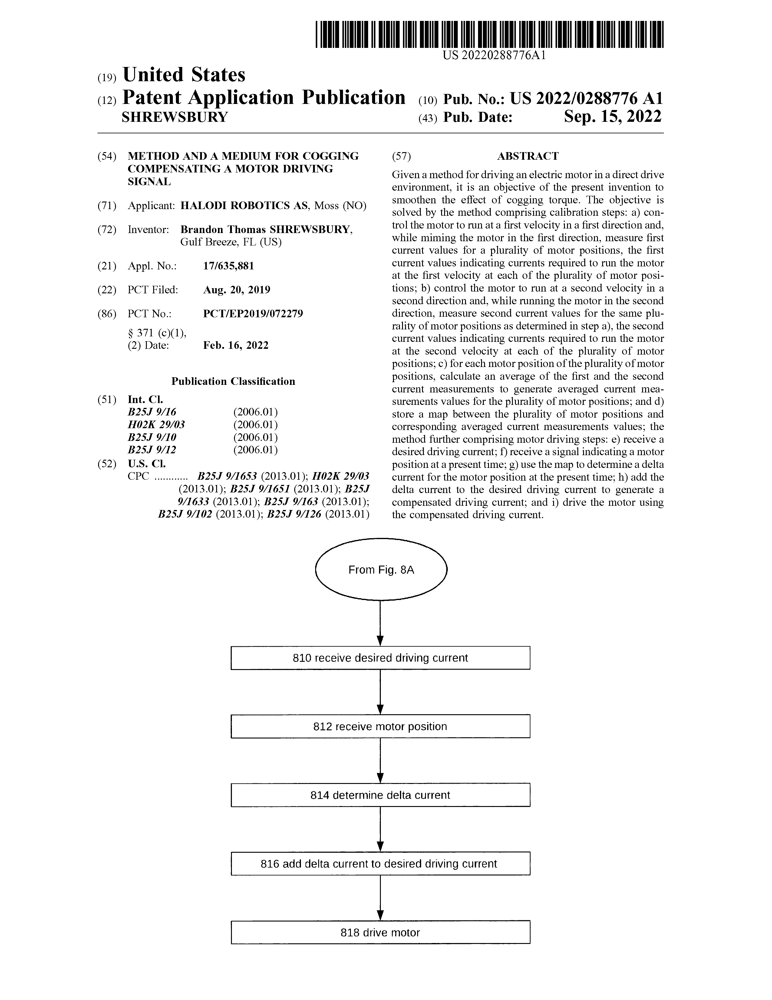

# METHOD AND A MEDIUM FOR COGGING COMPENSATING A MOTOR DRIVING SIGNAL

@1x_tech
's US20220288776A1 patent introduces a method for compensating cogging torque in direct drive electric motors.

This patent provides insights into how they are addressing the challenges of smooth motion control in humanoid robotics and other direct drive applications. 🧵

[FIG. 1A: Triangular reference trajectory for driving a motor]
[FIG. 1B: Corresponding substantially constant velocity in a first direction and a second direction]
[FIG. 2: Measurement of currents in a first and in a second direction for a full rotation of the motor]

FIG. 1A and 1B show the reference trajectory and resulting velocity profile for the calibration process. 
FIG. 2 illustrates the current measurements in both directions across a full motor rotation.

# 1. Core Innovation:
✅ Calibration process to measure motor current requirements in both directions
✅ Averaging of bidirectional current measurements to isolate cogging effects
✅ Creation of a position-based compensation map for real-time cogging torque correction

# 2. Key Components:
1️⃣ Direct drive electric motor with position sensor
2️⃣ Motor controller for precise velocity control
3️⃣ Current measurement system
4️⃣ Data processing and mapping system
5️⃣ Real-time compensation mechanism

# 3. Key Technical Features:
✅ Low-speed, constant velocity motor control for calibration
✅ Bidirectional measurements to cancel out non-cogging effects
✅ Filtering and subsampling of current data
✅ Look-up table generation for efficient real-time compensation

[FIG. 5: Current measurement data including average for each motor position]
[FIG. 6: Sub-sampling of averaged current measurement data]
[FIG. 8A and 8B: Method steps for smoothly driving an electrical motor in a direct drive environment]

FIG. 5 shows the averaging of bidirectional measurements
 FIG. 6 illustrates the subsampling process for the look-up table.
FIG. 8A and 8B provide a flowchart of the calibration and compensation processes.

# 4. Operational Mechanism:
1️⃣ Calibration: Run motor at constant velocities in both directions, measuring required currents
2️⃣ Data Processing: Average bidirectional measurements, filter, and subsample
3️⃣ Map Generation: Create a look-up table of compensation currents by position
4️⃣ Real-time Compensation: Use motor position to look up and apply delta current

# 5. Key Advantages:
✅ Enables smooth, jerk-free motion in direct drive applications
✅ Improves linearity of torque-current relationship
✅ Allows for open-loop torque control
✅ Compensates for manufacturing variations between motors

This technology represents a significant advancement in direct drive motor control, particularly for applications like humanoid robotics where smooth, precise motion is critical at low speeds

# Bibliography

#️⃣ Patent No.: US20220288776A1
📋 Title: Method and a medium for cogging compensating a motor driving signal
🏢 Applicant: Halodi Robotics AS
👥 Inventor: SHREWSBURY; Brandon Thomas
📅 Filing Date: 2022-04-08
📤 Publication Date: 2022-09-15
🔗 Link: https://patents.google.com/patent/US20220288776A1

