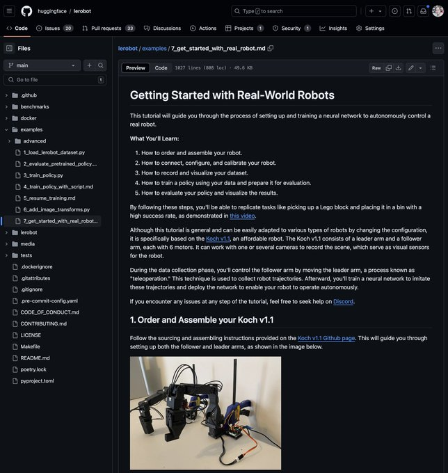

 # in-depth tutorial on how to build your own robot!

Teach it new skills by showing it a few moves with just a laptop.

Then watch your homemade robot act autonomously 🤯

Find our tutorial through this link: https://github.com/huggingface/lerobot/blob/main/examples/7_get_started_with_real_robot.md

Unlock the power of end-to-end learning — like LLMs for text, but designed for robotics! 🚀

You will learn how to train a neural network to directly predict the next motor rotations straight from camera images.

 We first guide you to our bill of materials to order your robot parts (in $, £ or €) through this github page: https://github.com/jess-moss/koch-v1-1

@JessMoss429864
 designed a new version of 
@alexanderkoch
 arms to ease assembly, and she open sourced the 3D files

 Jess also provided a guide to 3D print your parts. As soon as you gathered everything, you can start the assembly!

We've made some detailed videos to make things easy for you:
#1 https://youtu.be/8nQIg9BwwTk
#2 https://youtu.be/U78QQ9wCdpY
#3 https://youtu.be/8drnU9uRY24

 Next, you will record your first training set! You should start simple to validate your setup. For instance, we grasp the object at 5 locations and record 10 trajectories for each.

@alibert_s
 made a video to show you how easy it is:
#4 https://youtu.be/n_Ljp_xuFEM

You can also visualize any dataset with our custom tool, locally or online.

For instance, here is the dataset we recorded for the tutorial: https://huggingface.co/spaces/cadene/visualize_dataset_train

<video controls src="LnH3FoOv8uAssRGr.mp4" title="Title"></video>

 Next, you will train your neural network to control your robot. You only need a laptop for a few hours, PC or Mac.

No need for simulation!

After that, let's see what it learned! Check out the full video of our evaluation: https://youtu.be/Il3Kt8vqpI8

A super cool feature of our code is that we also record a dataset when the neural network controls the robot. Thus, you can also view it locally or share it online!

For instance, this is the recording of our eval:
https://huggingface.co/spaces/cadene/visualize_dataset_eval

<video controls src="CX0JQTH4qHVwBKPt.mp4" title="Title"></video>

